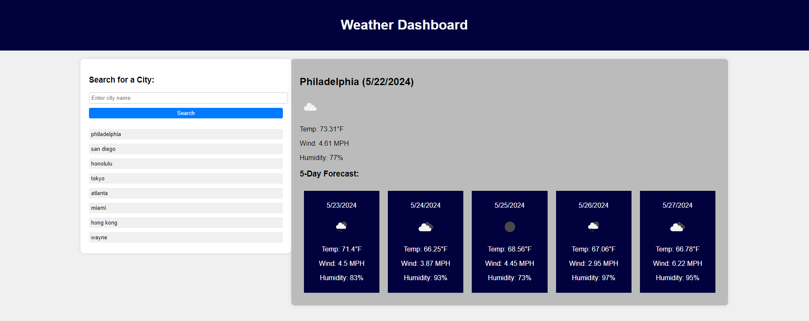

# Weather-Dashboard

## Description

This project was completed for the Columbia Coding Bootcamp. The purpose of this project was to create a page using the Openweathermap API to allow users to search for current weather in a city, as well as see the 5 day forecast.

## Installation

N/A

## Usage

This project can be accessed on Git Pages at the following URL: [https://boamarant.github.io/Weather-Dashboard/](https://boamarant.github.io/Weather-Dashboard/).

## Credits

I referenced previous projects and examples from the Columbia University Coding Bootcamp to assist in creating this page. ChatGPT helped me work through bugs that I was having. 

## Features

Users can search for a city in the search bar, and if the city is valid, weather information for the current day and following 5 days will be displayed, including temperature, wind speed, humidity, and an icon representing the weather conditions. There is a search history feature where users can click on their previously searched cities and see the information again.

## Screenshot of Application

